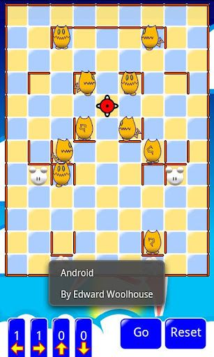

# ShokoRocket Android

A clone of the famous Chu-Chu Rocket.



## History

I wrote this many years ago, and back then Android phones weren't what they are now.

Devices had:

- 320x240 screens, or the fancy ones had 800x640
- A generous 512MB of RAM if you were lucky (honestly, this is actually quite a lot, even then)
- A heap that was sometimes randomly limited to 12MB
- A sub-1Ghz, in-order CPU with no floating point unit
- No JIT - the Java was interpretted!

This means that ShokoRocket is written in a way that /should/ accomodate these low end devices, but it doesn't make use of the latest and greatest APIs, and might not look great on a 4K screen.

## Building

There are two steps to building ShokoRocket

1. Generate bitmaps<br>
   The art for ShokoRocket lives under the `art` folder, and is defined as a bunch of SVGs. These can be rendered using the `art/render.sh` script.<br>
   This script requires Inkscape and bc on the path.
   > _Protip_ You can skip this step if you don't change the art
2. Providing signing keys<br>
   Edit `local.properties` and set the following

```
RELEASE_STORE_FILE=****
RELEASE_STORE_PASSWORD==****
RELEASE_KEY_ALIAS==****
RELEASE_KEY_PASSWORD=****
```

3. Build the signed APK<br>

```bash
gradlew assembleRelease
```

The resulting APK will be written to `app/build/outputs/apk/release`.

This process is due a bit of streamlining and dev-ops-ificiation.

## License and privacy policy

A privacy policy is required by Google Play, so one is included. No data is collected, and it takes 3000+ characters to say so

MIT license applied. If you do fork it, drop me a message. I'll be delighted.
